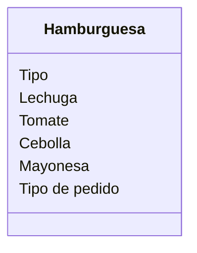

Un restaurante quiere ofrecer hamburguesas
Los clientes pueden elegir entre hamburguesa de: res, pollo
o vegetariana.
Los clientes pueden agregar extras como: lechuga, tomate, 
cebolla y mayonesa
Ademas los clientes pueden decidir comer en el restaurante 
o llevar su pedido

Requisitos:
- Ofrecer hamburguesas de res, pollo vegetariana
- Agregar extras lechuga
- Agregar extras tomate
- Agregar extras cebolla
- Agregar extras mayonesa
- Agregar extras para comer en el restaurante
- Agregar extras para llevar

Objetos:
- Hamburguesa

Caracteristicas:
- Hamburguesa
    - tipo 
    - lechuga
    - tomate
    - cebolla
    - mayonesa
    - tipo de pedido

Acciones:
- (No hay acciones)

Clases:
- Hamburguesa:
    - Nombre: Hamburguesa
    - Atributos:
        - Tipo
        - lechuga
        - tomate
        - cebolla
        - mayonesa
        - tipo de pedido
    - Metodos:
        - No hay métodos

Diagrama de clases:
