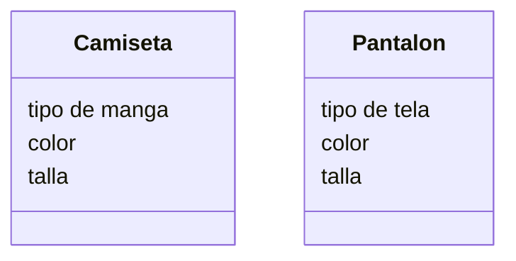

Una tienda de ropa quiere ofrecer camisetas y pantalones
Los clientes pueden elegir entre: camiseta
de manga corta o larga y pantalón de mezclilla o tela
Las camisetas pueden ser de color rojo, azul o verde
y los pantalones de color negro, gris o blanco
Las camisetas tienen las tallas: S, M, L, XL
Los pantalones tienen las tallas desde la 32 hasta la 44

Requisitos:
- Ofrecer camisetas y pantalones
- Tipos de camisetas:
    - manga corta
    - manga larga
- Tipos de pantalones:
    - mezclilla
    - tela
- Colores:
    - camisetas: rojo, azul, verde
    - pantalones: negro, gris, blanco
- Tallas:
    - Camisetas: S, M, L, XL
    - pantalones: 32 a 44

Objetos:
- Camiseta
- Pantalon 

Caracteristicas:
- Camiseta
    - tipo de manga
    - color
    - talla
- Pantalon
    - tipo de tela
    - color
    - talla

Acciones:
- (No hay acciones)

Clases:
- Camiseta:
    - Nombre: Camiseta
    - Atributos:
        - Tipo de manga
        - color (rojo, azul, verde)
        - talla (S, M, L ,XL)       
    - Metodos:
        - No hay métodos
- Pantalon:
    - Nombre: Pantalon
    - Atributos:
        - Tipo de tela
        - color (negro, gris, blanco)
        - talla del 32 al 44        
    - Metodos:
        - No hay métodos

Diagrama de clases:
