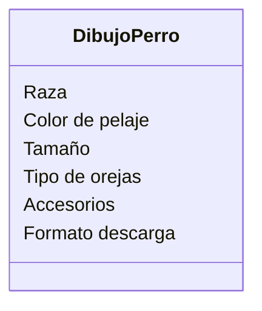

Estas diseñando una app para dibujar de perros con IA 
los usuarios pueden seleccionar características como 
la raza (por ejemplo, labrador o pastor alemán), el color 
del pelaje, el tamaño y el tipo de orejas.
Además, pueden agregar hasta dos accesorios, como sombreros 
o gafas.
El dibujo final puede descargarse en formato PNG o JPG.

Requisitos:
- Seleccionar caracteristicas
- raza 
- color de pelaje
- tamaño
- tipo de orejas
- Agregar hasta 2 accesorios
- Descarga formato PNG o JPG

Objetos:
- Dibujo perro

Caracteristicas:
- Dibujo perro
    - raza 
    - color de pelaje
    - tamaño
    - tipo de orejas
    - accesorios
    - formato descarga 

Acciones:
- (No hay acciones)

Clases:
- Dibujo perro:
    - Nombre: Dibujo perro
    - Atributos:
        - raza 
        - color de pelaje
        - tamaño
        - tipo de orejas
        - accesorios
        - formato descarga 
    - Metodos:
        - No hay métodos

Diagrama de clases:
