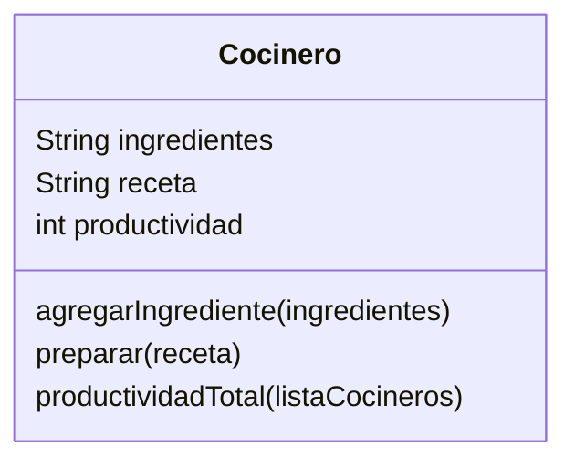

Imagina un sistema que modela el trabajo de cocineros en una cocina profesional.
Cada cocinero tiene tres elementos clave:

Una lista de ingredientes disponibles.
Un conjunto de recetas definidas que puede preparar
Un contador de productividad, que aumenta cada vez que prepara una receta con éxito. Si hay más de un cocinero, sus puntos individuales pueden sumarse para obtener una métrica agregada de productividad.

Las únicas recetas permitidas en el sistema son:

Receta      Ingredientes Requeridos
pan	        harina, agua
pizza	    harina, agua, sal, tomate, queso
galleta	    harina, agua, sal, chocolate

Realiza el análisis y diagrama de clases de la clase Cocinero en el archivo ejercicio_02.md.
Escribe el codigo en Python para la clase Cocinero en el archivo ejercicio_02.py.
Implementa los métodos de instancia, clase y estáticos según corresponda.
Instancia tres Cocineros y prueba sus métodos.
Muestra la métrica agregada de productividad.

Requisitos:
- un cocinero
    - Una lista de ingredientes disponibles
    - Un conjunto de recetas definidas (pan, pizza, galleta).
    - Un contador de productividad (int) que aumenta cuando prepara una receta con éxito
- Si hay varios cocineros, se puede obtener una productividad agregada sumando sus contadores
- Recetas permitidas y sus ingredientes
    - pan (harina, agua)
    - pizza (harina, agua, sal, tomate, queso)
    - galleta (harina, agua, sal, chocolate)

Objetos:
- Cocinero

Características:
- ingredientes: pan, pizza ,galleta List
- productividad: int

Acciones:
- Cocinero: entrenar, descansar, comer

