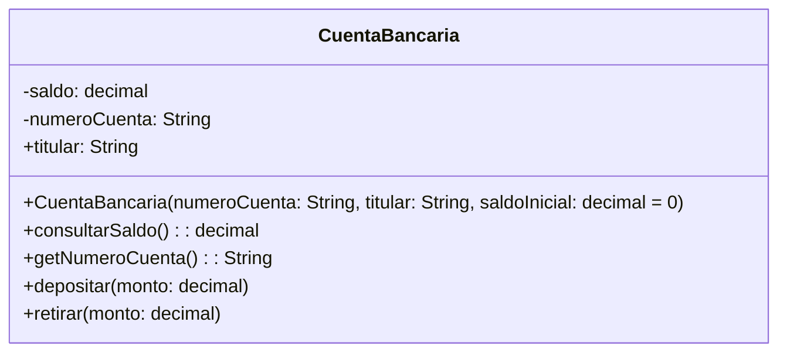

Un banco necesita desarrollar un módulo para gestionar cuentas bancarias. Cada cuenta tiene las siguientes caracteristicas:
 
saldo: Es un dato privado. Solo puede consultar. Se puede modificar únicamente a través de deposito y retiro
deposito: Permite ingresar dinero, incrementando el saldo.
retiro: Permite retirar dinero, siempre y cuando el saldo disponible sea suficiente.

número de cuenta: Es privado. Puede consultarse, pero no puede modificarse una vez asignado.
nombre del titular: Es público. Puede consultarse y modificarse libremente.

Realiza el análisis y diagrama de clases de la clase Cuenta en el archivo ejercicio_01.md.
Escribe el codigo en Python para la clase Cuenta en el archivo ejercicio_01.py.
Implementa encapsulamiento para proteger los atributos sensibles
Utiliza getters y setters para controlar el acceso y la modificación de los atributos.
Propiedades para ofrecer una interfaz clara y segura al usuario del sistema.

Requisitos
- Tiene un saldo (privado)
    - Solo se puede consultar
    - Solo se modifica mediante depositar y retirar
- Tiene un número de cuenta (privado)
    - Se consulta, pero no se modifica una vez asignado (inmutable)
- Tiene un nombre de titular (público)
    - Se puede consultar y modificar libremente

Objetos
- CuentaBancaria

Características
- CuentaBancaria:
    - saldo: decimal (privado)
    - numeroCuenta: String (privado, inmutable)
    - titular: String (público)

Acciones
- CuentaBancaria:
    -depositar(monto: decimal)
    -retirar(monto: decimal)
    -consultarSaldo(): decimal
    -getNumeroCuenta(): String

