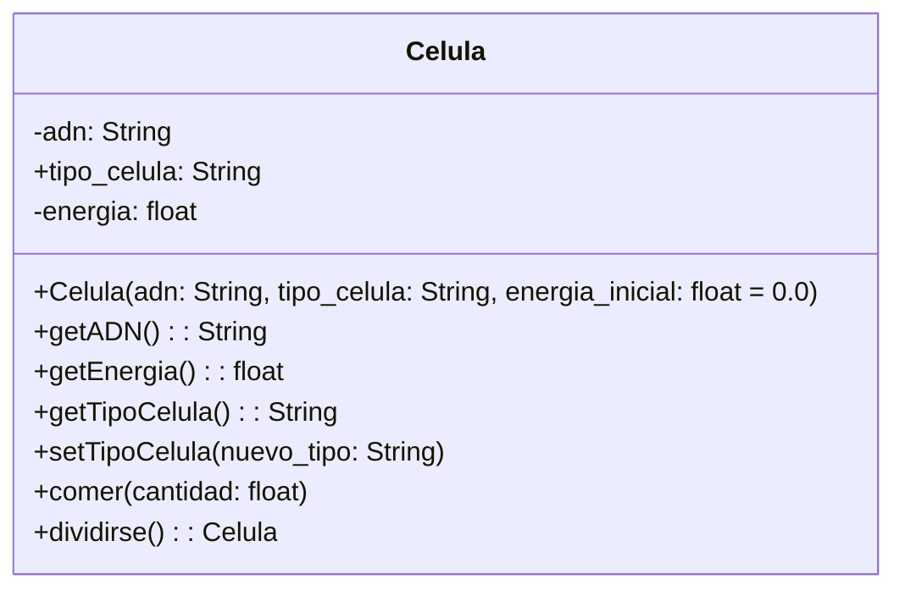

Un médico necesita simular el comportamiento de una célula. Cada célula debe cumplir con las siguientes características:
 
ADN: Se puede consultar pero no puede cambiar.
tipo de célula: Puede consultarse y modificarse libremente.
energía: Es un dato privado. Puede aumentar o disminuir, únicamente mediante las acciones de comer o dividirse.
Realiza el análisis y el diagrama de clases de la clase Celula en el archivo ejercicio_02.md.
Escribe el código en Python para la clase Celula en el archivo ejercicio_02.py.
Implementa encapsulamiento para proteger los atributos sensibles.
Utiliza getters y setters para controlar el acceso y la modificación de los atributos.
Aplica propiedades para ofrecer una interfaz clara y segura al usuario del sistema.

Requisitos:
- ADN: solo se consulta; no cambia 
- tipo_celula: se consulta y modifica libremente
- energía: privada; solo aumenta o disminuye mediante
    - comer()
    - dividirse()

Objeto:
- Celula

Características:
    - adn: String 
    - tipo_celula: String 
    - energia: float 
    - nuevo_tipo: Stringg

Acciones:
    - comer(cantidad: float) 
    - dividirse()
    - getEnergia()
    - getADN(): String 
    - getTipoCelula() 
    - setTipoCelula(nuevo_tipo)

