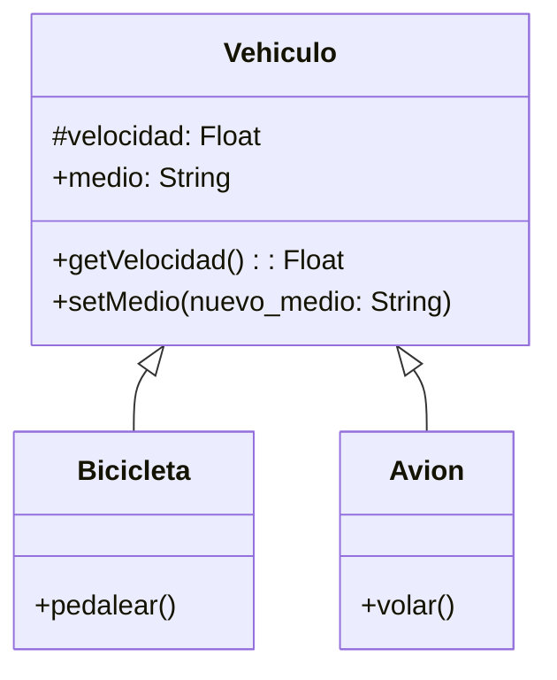

Una empresa de transporte desea desarrollar una simulación que represente el comportamiento de sus distintos vehículos.
Todo vehículo posee las siguientes características:

velocidad: Es un dato protegido. Puede consultarse, pero solo modificarse mediante acciones específicas.
medio: Representa el entorno en el que se desplaza el vehículo (por ejemplo, terrestre, acuático, aéreo). Puede consultarse y modificarse libremente.
Existen dos tipos de vehículos con características específicas:

Bicicleta: Incrementar su velocidad mediante la acción de pedalear.
Avión: Incrementar su velocidad mediante la acción de volar.
Realiza el análisis y el diagrama de clases de las clases Vehiculo, Bicicleta y Avion en el archivo ejercicio_01.md.
Escribe el código en Python para las clases Vehiculo, Bicicleta y Avion en el archivo ejercicio_01.py.
Aplica herencia de manera adecuada para el contexto de este ejercicio.

Requisitos:
- Todos los vehículos:
    - velocidad
    - medio
- La bicicleta incrementa su velocidad mediante la acción de pedalear
- El avion incrementa su velocidad mediante la acción de volar

Objetos:
- Vehiculo (Clase Padre)
- Bicicleta (hereda de Vehiulo)
- Avion (hereda de Vehiculo)

Características:
- Vehiculo:
    - velocidad: Float
    - medio: String
    - nuevo_medio: String
- Bicicleta:
    - (sin características)
- Avion:
    - (sin características)

Acciones:
- Vehiculo:
    - getVelocidad()
    - setMedio(nuevo_medio)
- Bicicleta:
    - pedalear()
- Avion:
    - volar()

