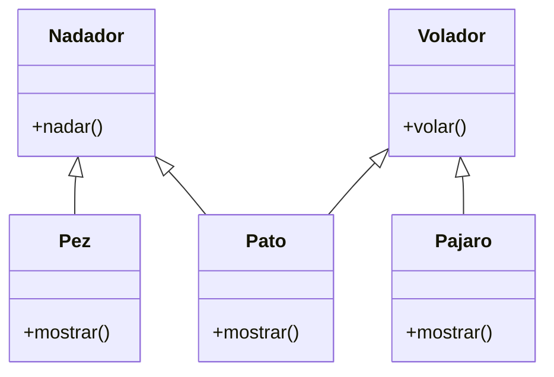

Debes desarrollar un videojuego tipo aventura, donde los personajes tiene distintas habilidades
Cada personaje pertenece a uno o más tipos que definen sus comportamientos:

Nadador: Puede ejecutar la acción nadar(), que representa la acción de desplazarse en el agua.
Volador: Puede ejecutar la acción volar(), que representa la acción de desplazarse por el aire.
En el juego existen tres personajes principales, cada uno con habilidades específicas:

Pez: tiene la habilidad de nadar.
Pájaro: tiene la habilidad de volar.
Pato: tiene ambas habilidades, puede nadar y volar.
Cada personaje debe contar con un método mostrar() que indique el tipo de personaje y su habilidad principal o combinada.
Realiza el análisis y diagrama de clases de las clases Nadador, Volador, Pez, Pajaro y Pato en el archivo ejercicio_02.md.
Escribe el código en Python de las clases Nadador, Volador, Pez, Pajaro y Pato en el archivo ejercicio_02.py.
Aplica herencia múltiple de manera adecuada para el contexto de este ejercicio.
Utiliza un método mostrar() en cada clase para identificar al personaje y sus habilidades.

Requisitos:
- nadador puede ejecutar nadar()
- volador puede ejecutar volar()
- pez: personaje que nada.
- pajaro: personaje que vuela
- pato: personaje que nada y vuela
- todo personaje tiene un método mostrar() que indica su tipo y habilidad principal

Objetos:
- Nadador (clase padre)
- Volador (clase padre)
- pez (hereda de Nadador)
- pajaro (hereda de Volador)
- pato (hereda de Nadador y Volador)

Características:
- Nadador:
    - (sin caracteristicas)
Volador:
    - (sin caracteristicas)
Pez:
    - (sin caracteristicas)
Pajaro:
    - (sin caracteristicas)
Pato:
    - (sin caracteristicas)

Acciones:
- Nadador:
    - nadar()
- Volador:
    - volar()
- Pez:
    - mostrar()
- Pajaro:
    - mostrar()
- Pato:
    - mostrar()

