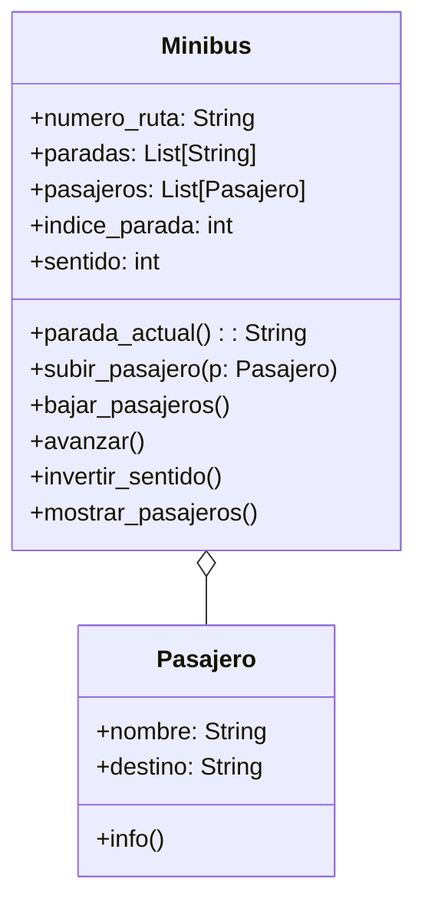

En su trayecto diario al trabajo, las personas pueden abordar distintos minibuses. Cada minibus está identificado por un número de ruta y sigue un recorrido compuesto por varias paradas (ubicaciones). Por otro lado, cada pasajero tiene un nombre y una ubicación de destino a la que desea llegar.
Los pasajeros pueden subir o bajar del minibus en cualquier parada, pero bajo las siguientes condiciones:

Un pasajero solo puede subir si el recorrido del minibus incluye su destino entre las paradas programadas.
Un pasajero solo puede bajar si la parada actual del minibus coincide con su destino.
Las paradas son circulares: al llegar al final del recorrido, el minibus invierte su lista de paradas y regresa en sentido contrario.
Diseñar las clases necesarias para representar Minibus y Pasajero.
Toma en cuenta las siguientes características:
Un minibus tiene una lista de paradas programadas (ejemplo: ["Arce", "Prado", "Perez"]).
Un minibus puede transportar múltiples pasajeros.
Simular el movimiento del minibus entre paradas y las acciones de subida y bajada de pasajeros.
Realiza el análisis y diagrama de clases para las clases Minibus y Pasajero en el archivo ejercicio_01.md.
Escribe el código en Python para las clases Minibus y Pasajero en el archivo ejercicio_01.py.
Aplica los principios de relaciones entre las clases (composición o agregación según corresponda).

Asegúrate de que las clases incluyan atributos y métodos coherentes con su propósito.
Utiliza buenas prácticas de nomenclatura, encapsulamiento y legibilidad.

Requisitos:
- Cada minibús tiene un número de ruta y una lista de paradas ("Arce","Prado","Perez")
- un minibús puede transportar múltiples pasajeros
- subir pasajero: solo si el destino del pasajero está en las paradas del recorrido
- bajar pasajero: solo si la parada actual coincide con su destino
- movimiento circular: al llegar al extremo de la lista de paradas, el minibús invierte el sentido y recorre en dirección contraria
- simular avance entre paradas y las acciones de subida y bajada

Objetos:
- Minibus
- Pasajero

Características:
- Pasajero:
    - nombre: String
    - destino: String
- Minibus:
    - numero_ruta: String
    - paradas: List[String]
    - pasajeros: List[Pasajero]
    - indice_parada: int (indice de la parada actual)
    - sentido: int (1 hacia adelante, -1 hacia atras)

Acciones:
- Pasajero:
    - info() (mostrar nombre y destino)
- Minibus:
    - parada_actual(): String
    - subir_pasajero(p: Pasajero) 
    - bajar_pasajeros() 
    - avanzar() 
    - invertir_sentido() (invierte la dirección del recorrido)
    - mostrar_pasajeros() (lista pasajeros a bordo)

